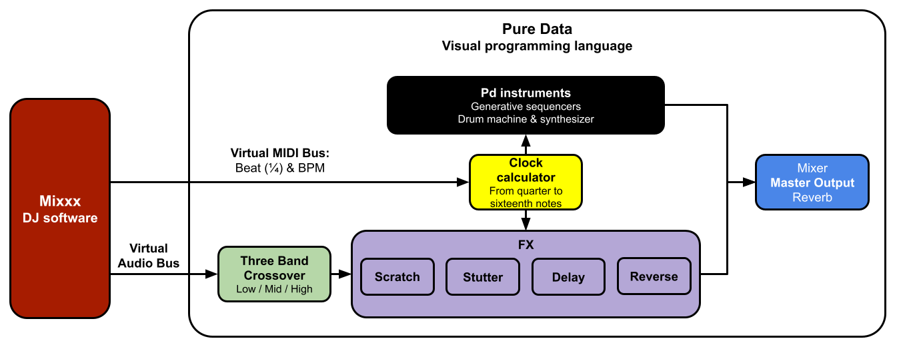

# Hybrid-DJ-Set
This patch synchronizes DJ software Mixxx with Pure data to layer drum machines and synths in a live performance.

--------------------------------------------------------------------------
<h3 align="center">
  <a href="https://github.com/MikeMorenoDSP/Hybrid-DJ-Set/archive/refs/heads/main.zip">Download ZIP</a>
</h3>

--------------------------------------------------------------------------

## Signal Flow

## Installation
1. Download Mixxx: https://mixxx.org/
2. Download Pure Data: https://puredata.info/
3. Set up a virtual MIDI bus:
    * [Apple: Transfer MIDI information between apps in Audio MIDI Setup on Mac](https://support.apple.com/guide/audio-midi-setup/transfer-midi-information-between-apps-ams1013/mac)
    * [Ableton: Setting up a Virtual MIDI Bus](https://help.ableton.com/hc/en-us/articles/209774225-Setting-up-a-virtual-MIDI-bus)
    * [Windows: Loop MIDI](http://www.tobias-erichsen.de/software/loopmidi.html)
4. On Mixxx, open up "Preferences..." > select "Controllers" > select your Virtual MIDI Bus.
    * On Load Mapping, select "MIDI for light"
    * Click enable and apply.
5. On Pure Data, open up "MIDI..." > select your virtual MIDI bus as input.
6. Install the else library.
    * [How do I download and install external libraries](https://mikemorenodsp.github.io/pure-data-faq/#how-do-i-download-and-install-external-libraries)
7. Optional: use a virtual audio bus to send the audio from Mixxx to Pd.
    * [How do I send audio or MIDI from pd to another application](https://mikemorenodsp.github.io/pure-data-faq/#how-do-i-send-audio-or-midi-from-pd-to-another-application)
    * On Pd, select "Audio..." select your virtual audio bus as input.
8. Open "djset.pd"

## Recommendation
Use spotdl for quickly downloading playlists with all the metadata: https://github.com/spotDL/spotify-downloader

## References
* [Mixxx: MIDI clock output](https://github.com/mixxxdj/mixxx/wiki/MIDI%20clock%20output)